# Readmission Risk MLOps

A 30-day hospital readmission risk prediction system for diabetic patients, wrapped in the operational scaffolding of a real production ML platform: experiment tracking, a containerised API, automated drift checks, a promote-if-better retraining gate, a subgroup fairness audit, and a Streamlit dashboard on top.

[](https://www.python.org/)
[](LICENSE)
[](https://huggingface.co/spaces/shrutidevlekar/readmission-risk)

> **Try the live demo:** <https://huggingface.co/spaces/shrutidevlekar/readmission-risk>

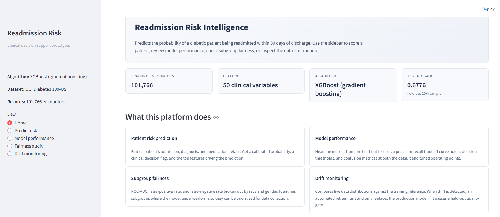

## What it does

Trained on 101,766 inpatient encounters from the UCI Diabetes 130-US dataset, the model predicts whether a discharged diabetic patient will be readmitted within 30 days. The platform wraps the model in everything you would actually need to operate it: tracking, serving, monitoring, retraining, fairness auditing, and a clean dashboard.

## Quick tour

| | |
| :---: | :---: |
| **Patient risk prediction** | **Model registry and tracking** |
| 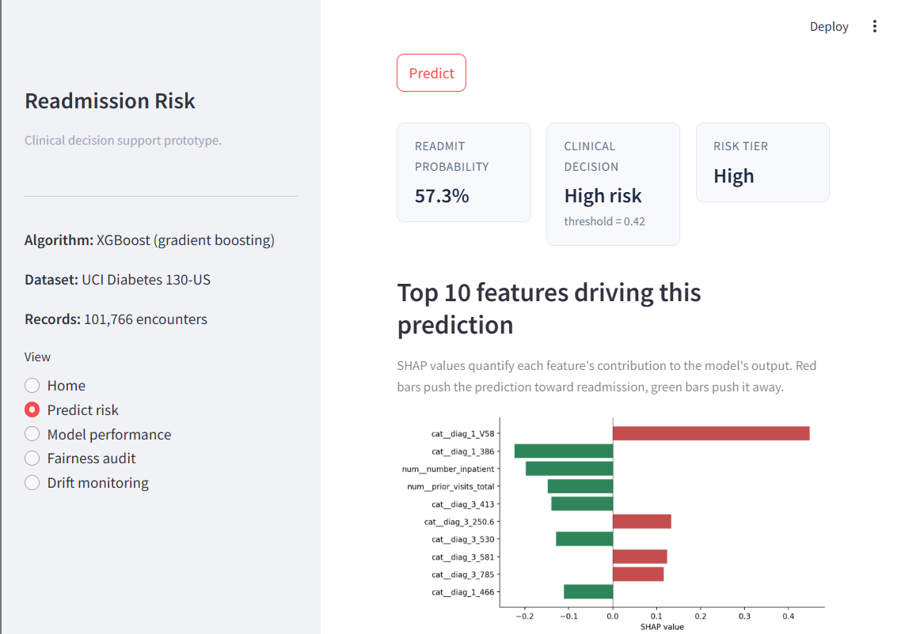 | 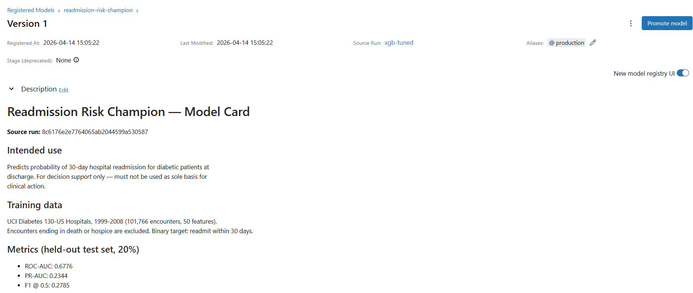 |
| **Drift monitoring** | **Subgroup fairness audit** |
| 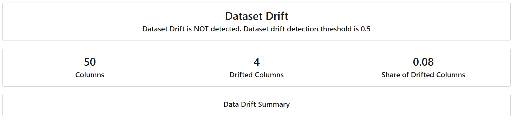 | 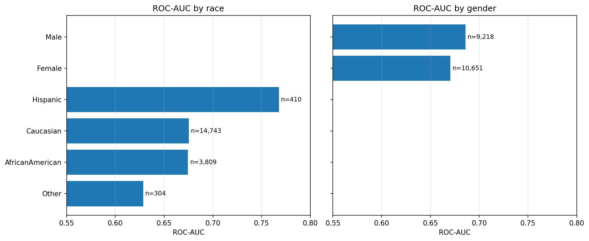 |

## Results on the held-out test set

| Metric                     | Value  |
| -------------------------- | ------ |
| ROC-AUC                    | 0.6776 |
| PR-AUC                     | 0.2344 |
| F1 at 0.5                  | 0.2785 |
| Base rate (positive class) | 11.4%  |
| PR-AUC lift over base rate | 2.06x  |

F1 looks low because the default 0.5 threshold is poorly matched to an 11% positive class. The `src.threshold` script sweeps the decision threshold and writes a tuned operating point that the API plugs into its predictions.

## What's in the box

**Training and modeling**

- Five candidate algorithms compared on the same split (Logistic Regression, Random Forest, XGBoost, LightGBM, MLP).
- Optuna TPE hyperparameter search (25 trials, 3-fold stratified CV) on the winner.
- SHAP explainability with global bar / beeswarm plots and per-patient force plots.
- A SMOTE vs. class-weighting ablation, with the winning strategy justified.

**Operational pieces**

- MLflow for experiment tracking and a Model Registry with a `production` alias.
- FastAPI service with Pydantic v2 validation, a `/predict` endpoint that returns SHAP attributions, plus `/health` and `/model-info`. OpenAPI docs auto-generated at `/docs`.
- Multi-stage Docker build, non-root user, built-in HEALTHCHECK.
- Pytest covering feature engineering and end-to-end API behaviour.

**Monitoring and retraining**

- Evidently data drift report across all 50 features, producing an HTML artifact and a JSON verdict the CI can read.
- Automated retraining script that inherits the Production hyperparameters, evaluates the candidate against the current Production model on a shared test set, and only promotes if ROC-AUC improves by a safety margin.
- Subgroup fairness audit covering ROC-AUC, FPR, and FNR per race and gender.

**Presentation**

- Streamlit dashboard with a home page, patient scorer, performance view, fairness view, and drift monitor.
- GitHub Actions workflows for lint, test, model quality gate, Docker build, and a scheduled drift check + retrain.

## Stack

`Python 3.10` `scikit-learn` `XGBoost` `LightGBM` `Optuna` `MLflow` `SHAP`
`FastAPI` `Pydantic` `Docker` `Evidently` `Streamlit` `pytest` `GitHub Actions`

All free and self-hostable.

## How to run it locally

You need Python 3.10, a virtual environment, and about 4 GB of free disk space. Docker is needed only for the container step.

```bash
python -m venv venv
# Windows:  venv\Scripts\activate
# Unix:     source venv/bin/activate
pip install -r requirements.txt
```

**Train the champion**

```bash
python -m src.data_loader        # downloads and caches the UCI dataset
python -m src.train_sweep        # 5-model comparison
python -m src.tune_champion      # Optuna on the winner
python -m src.register <run_id>  # register in MLflow as Production
```

**Serve it**

```bash
python -m src.export_model                     # freeze champion to artifacts/champion.pkl
pytest -v                                      # 8 tests
uvicorn app.main:app --reload                  # http://127.0.0.1:8000/docs
docker build -t readmission-api:1.0 .
docker run --rm -p 8000:8000 readmission-api:1.0
```

**Drift, retrain, fairness, threshold**

```bash
python -m src.simulate_drift   # build reference and drifted current parquet files
python -m src.drift            # Evidently report and verdict JSON
python -m src.retrain          # retrain on combined data, promote only if better
python -m src.threshold        # find the best operating point
python -m src.fairness         # subgroup audit
python -m src.train_smote      # SMOTE ablation logged alongside baselines
```

**Dashboard**

```bash
streamlit run streamlit_app.py   # http://127.0.0.1:8501
```

## A few more screenshots

<details>
<summary>Click to expand: SHAP, MLflow, FastAPI</summary>

| | |
| :---: | :---: |
| **SHAP global feature importance** | **SHAP for one high-risk patient** |
| 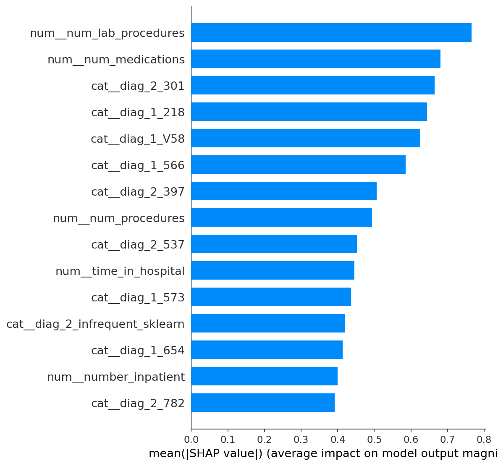 | 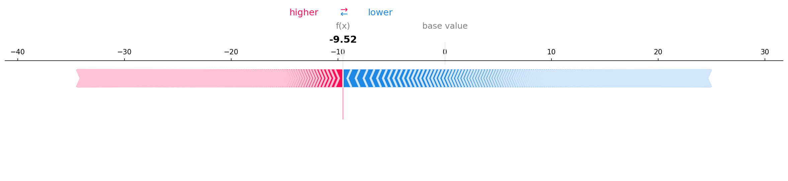 |
| **MLflow model comparison** | **FastAPI auto-generated docs** |
| 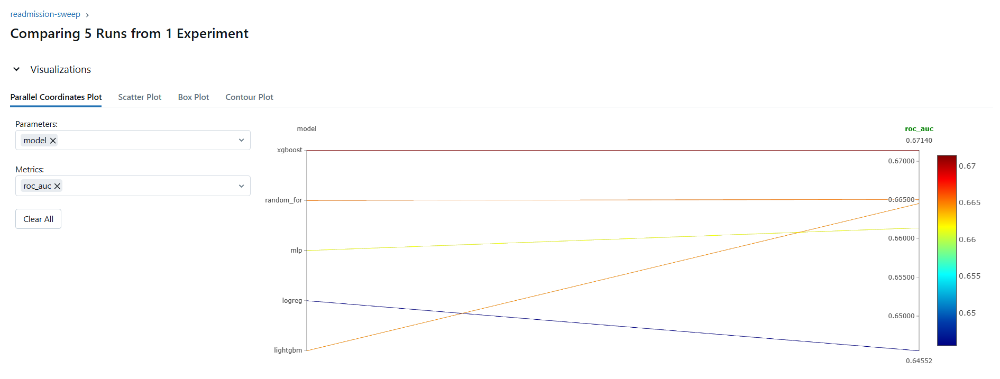 | 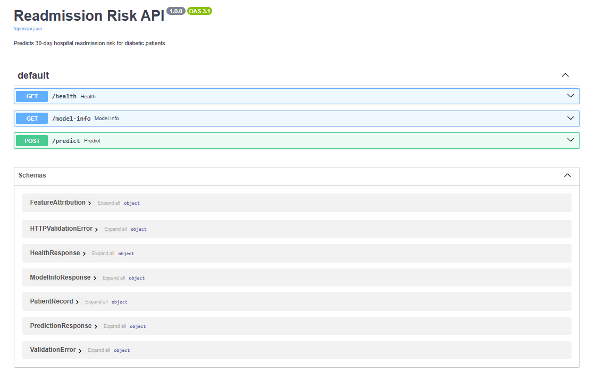 |
| **Threshold sweep** | **Drift report (one feature)** |
| 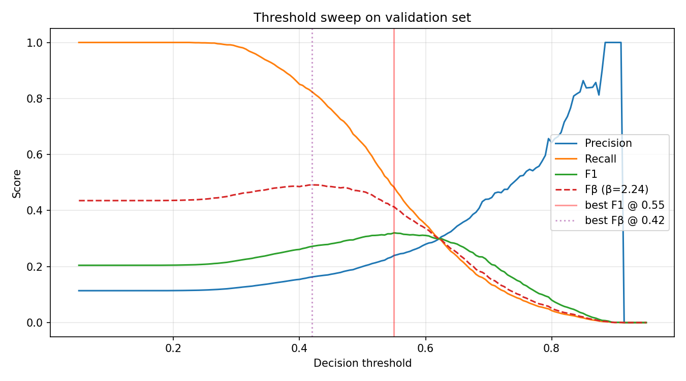 | 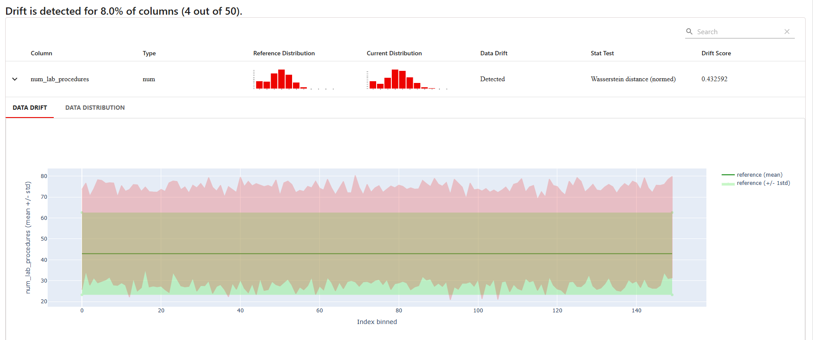 |

</details>

## Repo layout

```text
src/                 training, features, drift, retrain, fairness, threshold
app/                 FastAPI service (main.py, schemas.py, model_loader.py)
tests/               pytest unit and integration tests
streamlit_app.py     multi-page dashboard
Dockerfile           multi-stage build, non-root user, HEALTHCHECK
.github/workflows/   CI (lint, test, gate, build) and weekly drift + retrain
artifacts/           exported champion.pkl, threshold.json, metadata
reports/             drift and fairness verdicts, Evidently HTML report
docs/screenshots/    SHAP plots, MLflow captures, dashboard screenshots
```

## Notes and caveats

The model sits around 0.67 to 0.68 ROC-AUC because much of what drives readmission (medication adherence, post-discharge care, social support) is not in the dataset. Grinding for another point of AUC was not the goal; the goal was end-to-end operational plumbing.

SMOTE was tested against `scale_pos_weight`. They matched on ROC-AUC but SMOTE took 7.5x longer to train and broke probability calibration (F1 fell from 0.28 to 0.03 at a 0.5 threshold). Class-weighting stayed.

The retrain safety gate blocked a drift-triggered candidate from replacing Production because the candidate did not outperform on a shared test set. That is the intended behaviour; a noisy drift event should not silently regress a working model.

The fairness audit found a 0.14 gap in ROC-AUC between the best and worst race subgroups, concentrated in the smallest and most underrepresented groups. A real deployment response would be targeted data collection for those groups rather than a model patch.

## License

MIT
